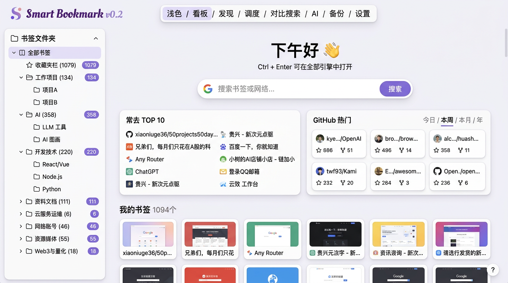

# 告别翻不动的 1000+ 书签：开源 Chrome / Edge 浏览器书签管理插件 Smart Bookmark 0.2 发布

> **关键词**：浏览器书签管理 · 收藏夹管理插件 · Chrome 书签清理扩展 · Edge 新标签页 · 开源 · 本地安装 · AI 搜索 · MV3 扩展
>
> 一个 Chrome / Edge 双平台的浏览器书签收藏夹管理插件，把「**书签清理 + 新标签页看板 + AI 搜索 + 对比搜索 + 悬浮球 + 二维码 + 备份导出**」一次性打包给你。暂未上架 Chrome 应用商店 / Edge 外接程序，**本地解压即装，5 秒就能用上**。
>
> 📦 GitHub 仓库：<https://github.com/xiaoniuge36/Smart-Bookmark>
> 💖 觉得有用的话，顺手给个 Star，让更多人看到独立开发者的作品。


---

## 一、为什么又做了一个 Chrome / Edge 浏览器书签管理插件？

作为一个每天开 20+ 标签页的重度用户，我的浏览器**收藏夹（书签）**大概率长这样：

- 1000+ 条书签，一半域名不知道是啥
- Chrome 默认新标签页是一片白，每次都得手动敲网址
- 想找昨天刚存的文章？翻三层目录，还是没找到
- 有几十条链接点开是 404，但没人帮你清理
- 网站挪去分享手机，只能复制 URL 粘到微信，再扫一道二维码

市面上已经有 [LazyCat Bookmark Cleaner](https://github.com/Alanrk/LazyCat-Bookmark-Cleaner) 专门做清理，有 [TabMark](https://github.com/Alanrk/TabMark-Bookmark-New-Tab) 专门做看板，但我想要的是 **一个扩展解决所有问题**——所以有了 **Smart Bookmark**。

它不是对某一款的复刻，而是站在这些优秀前辈的肩膀上做融合，并补齐了我自己每天都会用到的十几个小场景。

---

## 二、Smart Bookmark 能做什么？—— 9 大浏览器书签管理核心能力

### 📑 1. 新标签页看板（把收藏夹当主页用）



> _（上图为 Smart Bookmark 新标签页实际效果：左侧文件夹树、中间搜索框 + GitHub 热门、下方「我的书签」卡片墙）_

- **左侧文件夹树**：一键把常用文件夹设为主页
- **书签卡片墙**：舒适 / 紧凑两种密度，喜欢哪个选哪个
- **🆕 拖拽排序**：按住卡片拖动，顺序**同步写回书签**，不是只在前端记
- **🆕 右键菜单**：复制链接 / 生成二维码 / 删除，一步到位
- **自定义壁纸**：本地 URL 或远程链接都行
- **暗黑模式**：跟随系统 / 强制浅色 / 强制深色
- **智能搜索**：命中书签直接回车跳转，未命中自动跳搜索引擎

### 🧹 2. 书签清理中心（`Alt+Shift+C` 一键呼出）

- **失效链接检测**：基于 HEAD/GET 探测，死链一目了然
- **重复书签检测**：智能归一化 URL，会自动忽略 `utm_*` / hash / 末尾斜杠等差异
- **空文件夹检测** / **异常 URL 检测**
- 扫描前预览 → 分组勾选 → 批量清理
- **书签画像**：总数、Top 域名、近 30 天新增，一眼看清自己的收藏习惯

### ✨ 3. AI 助手（OpenAI / Anthropic 可选）

- API Key 只存本地 `chrome.storage.local`，绝不外发
- 流式输出，随时可停
- 可以让 AI 基于你的书签上下文回答问题（例如「我之前收藏过那篇讲 React Hooks 的文章，帮我找出来」）

### 🔀 4. 对比搜索（0.2 新增）

同一个关键词，**Google / Bing / DuckDuckGo / 百度 / GitHub / Stack Overflow / YouTube / MDN** 多选并排看结果。

- 支持 iframe 的引擎直接内嵌
- 禁用 iframe 的引擎一键在新 tab 打开
- 「在全部引擎打开」一键分发到多个 tab，技术选型 / 报错排查一秒完成

### 🎈 5. 网页内悬浮球（0.2 新增，`Alt+Shift+F` 切换）

- 任意网页右下角的迷你悬浮按钮，可拖动，位置持久化
- 点击展开：书签即时搜索、打开侧边栏、打开清理中心、复制当前 URL、生成二维码
- **Shadow DOM 隔离样式**，绝不污染原网页
- 不想用时 `Alt+Shift+F` 一键关闭

### 🔳 6. 二维码生成（0.2 新增）

卡片菜单 / 悬浮球 / 右键菜单都能一键生成，支持浅色 / 深色自动适配，支持下载 PNG / 复制 URL——**从 PC 把链接给手机，再也不用微信传自己**。

### 💾 7. 备份 / 导入导出（0.2 新增）

- 导出完整书签树为 **JSON**（Smart Bookmark 自有格式，可完整还原）
- 导出为 **Netscape HTML**（Chrome / Edge / Firefox / Safari 都能直接导入）
- 反向导入时**仅新增、重复 URL 自动跳过**，绝不覆盖你现有的宝贝

### 🌐 8. 中 / 英双语

全 UI 覆盖，跟随系统切换；也能在设置页手动切换，实时生效。

### 📌 9. 侧边栏 + 右键菜单 + 快捷键

- `Alt+B` / `⌘+B` → 打开侧边栏，书签搜索随叫随到
- `Alt+Shift+C` → 打开清理中心
- `Alt+Shift+F` → 切换悬浮球
- 选中任意文字 → 在 Smart Bookmark 中搜索
- 任意链接 → 复制 / 生成二维码

---

## 三、Chrome / Edge 本地导入安装教程（零构建、5 秒上手）

> Smart Bookmark **暂未上架 Chrome 商店 / Edge 外接程序**，推荐通过「加载已解压的扩展程序」方式安装。仓库已附带最新的预构建产物 `dist/`，`git clone` 完**无需 npm install、无需 npm run build**，直接加载即可。

### 📥 第一步：把仓库 clone 或下载到本地

```bash
git clone https://github.com/xiaoniuge36/Smart-Bookmark.git
```

不想装 Git 也行，在 GitHub 页面右上角点 **Code → Download ZIP**，下载后解压到任意位置即可（例如 `D:\extensions\Smart-Bookmark\`）。

> 后面所有步骤要选的都是 **解压后的 `dist/` 文件夹**，不是根目录！

---

### 🔵 第二步（Chrome 浏览器版）：加载已解压的扩展程序

1. 打开 Chrome，在地址栏输入：

   ```
   chrome://extensions
   ```

2. 右上角打开 **「开发者模式」** 开关（Developer mode）。
3. 左上角点击 **「加载已解压的扩展程序」**（Load unpacked）。
4. 在弹窗中定位到你下载的仓库目录，**选择里面的 `dist/` 文件夹**，点击「选择文件夹」。
5. 列表里会出现 `Smart Bookmark - 书签清理 + 新标签页`，图标为紫色书签。
6. 打开一个新标签页（`Ctrl+T`），Smart Bookmark 的看板就出来了 🎉

> 💡 建议把扩展图标固定到工具栏：点击右上角拼图图标 → 找到 Smart Bookmark → 点后面的图钉。

---

### 🟦 第二步（Edge 浏览器版）：加载解压缩的扩展

Edge 基于 Chromium，流程几乎一致：

1. 打开 Edge，在地址栏输入：

   ```
   edge://extensions
   ```

2. 在**左下角**打开 **「开发人员模式」** 开关。
3. 点击上方 **「加载解压缩的扩展」** 按钮。
4. 定位到仓库目录，**选择 `dist/` 文件夹**，点击「选择文件夹」。
5. 看到 Smart Bookmark 出现在列表即安装成功，可以顺手点「详细信息」→ 打开「允许在 InPrivate 模式下」按需开启。
6. `Ctrl+T` 打开新标签页，享用 🚀

> ⚠️ 如果 Edge 的新标签页没有自动变成 Smart Bookmark：打开 `edge://settings/newTabPage` 检查是否被 Edge 内置页强制占用；必要时关闭 Edge 自带的新标签页偏好即可。

---

### 🔄 后续更新

仓库的 `dist/` 会随代码更新一并提交。更新方式：

```bash
cd Smart-Bookmark
git pull
```

然后回到 `chrome://extensions` / `edge://extensions`，点 Smart Bookmark 右下角的 **刷新按钮（🔄）** 即可。

---

### 🛠️ 本地开发 / 自行构建（可选）

想魔改源码：

```bash
npm install
npm run build     # 重新生成 dist/
npm run zip       # 打包 dist.zip（上传商店用）
```

构建流程：`icons.mjs` 批量从 `icon.svg` 导出四个 PNG → `tsc -b` 类型检查 → `vite build` 产出各入口 → `postbuild.mjs` 把 `manifest.json` 和图标搬进 `dist/`，并把 HTML 上移到根目录。

目录结构：

```
smart-bookmark/
├── manifest.json            # MV3 manifest
├── public/icons/            # 图标源（SVG）与导出 PNG
├── scripts/
│   ├── icons.mjs            # sharp 批量导出 PNG
│   ├── postbuild.mjs        # 拷贝 manifest & icons，HTML 上移
│   └── zip.mjs              # 打包 dist.zip
├── src/
│   ├── background/          # Service Worker
│   ├── content/             # 网页内悬浮球（Shadow DOM）
│   ├── newtab/              # 新标签页（看板 / 清理 / 对比 / AI / 备份 / 设置）
│   ├── sidepanel/           # 侧边栏
│   ├── popup/               # 工具栏弹窗
│   ├── components/ui/       # shadcn/ui 组件 + toast
│   ├── lib/                 # bookmarks / cleaner / ai / storage / theme
│   │                        # backup / i18n / qr / utils
│   ├── types/               # 共享类型
│   └── styles/              # Tailwind globals
└── vite.config.ts
```

技术栈一览：**React 18 + TypeScript 5 + Vite 5 + Tailwind 3 + shadcn/ui + Radix UI + lucide-react + MV3 Service Worker**。

---

## 四、隐私说明

这是独立开发者最想让你看到的部分：

- **书签数据 100% 本地处理**，不会上传任何服务器
- **AI API Key 仅保存在 `chrome.storage.local`**，直连官方 API，中间人零信任
- **失效链接检测** 是唯一会发请求的模块（向对应域名发 HEAD/GET），扫描时**可选关闭**
- **悬浮球**只在你主动开启时才注入；注入时不发任何网络请求，搜索完全走本地书签
- 完整隐私政策：[PRIVACY.md](./PRIVACY.md) · [在线版](https://xiaoniuge36.github.io/Smart-Bookmark/privacy.html)

---

## 五、Roadmap

### 已完成 ✅（0.2）

- [x] 拖拽排序 / 文件夹内自定义顺序
- [x] 生成二维码 / 复制 URL 上下文菜单
- [x] 对比搜索（多引擎并排）
- [x] 网页内悬浮球
- [x] 备份 / 导出 JSON & HTML
- [x] 中英 i18n

### 下一步候选

- [ ] OAuth 版 Google Bookmarks / Pocket / Raindrop 同步
- [ ] 书签标签（Tag）与智能分组
- [ ] 基于 AI 的书签自动分类 / 去重建议
- [ ] 浏览器历史可视化时间线
- [ ] 书签导出为 Markdown
- [ ] PWA 版本 / Firefox 适配

---

## 六、求关注 🙏

Smart Bookmark 完全开源（MIT），没有任何收集、没有任何云端，是我每天都在用的私人工具。

如果它帮你省下了 1 分钟翻收藏夹的时间：

- ⭐ [GitHub](https://github.com/xiaoniuge36/Smart-Bookmark) 点个 Star，让它被更多人看到
- 🐛 遇到 Bug 或想要新功能？开 [Issue](https://github.com/xiaoniuge36/Smart-Bookmark/issues)
- 💡 PR 更欢迎——Roadmap 里任何一项都欢迎认领

> 「让浏览器从信息入口，重新变成你的第二大脑。」
>
> —— Smart Bookmark，一个独立开发者认真写的浏览器扩展。

---

**📎 快速链接**

- 仓库地址：<https://github.com/xiaoniuge36/Smart-Bookmark>
- 隐私政策：<https://xiaoniuge36.github.io/Smart-Bookmark/privacy.html>
- License：MIT

---

**🔖 相关标签（方便检索）**

`Chrome 扩展` · `Edge 扩展` · `MV3 浏览器插件` · `书签管理` · `收藏夹管理` · `书签清理` · `新标签页插件` · `TabMark 替代` · `LazyCat Bookmark Cleaner 替代` · `AI 搜索插件` · `开源浏览器扩展` · `React + Vite + Tailwind` · `Smart Bookmark`
